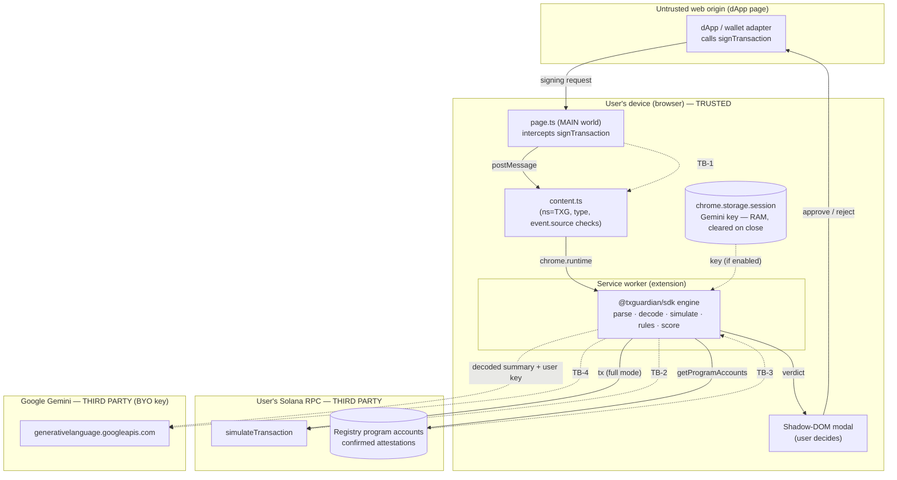
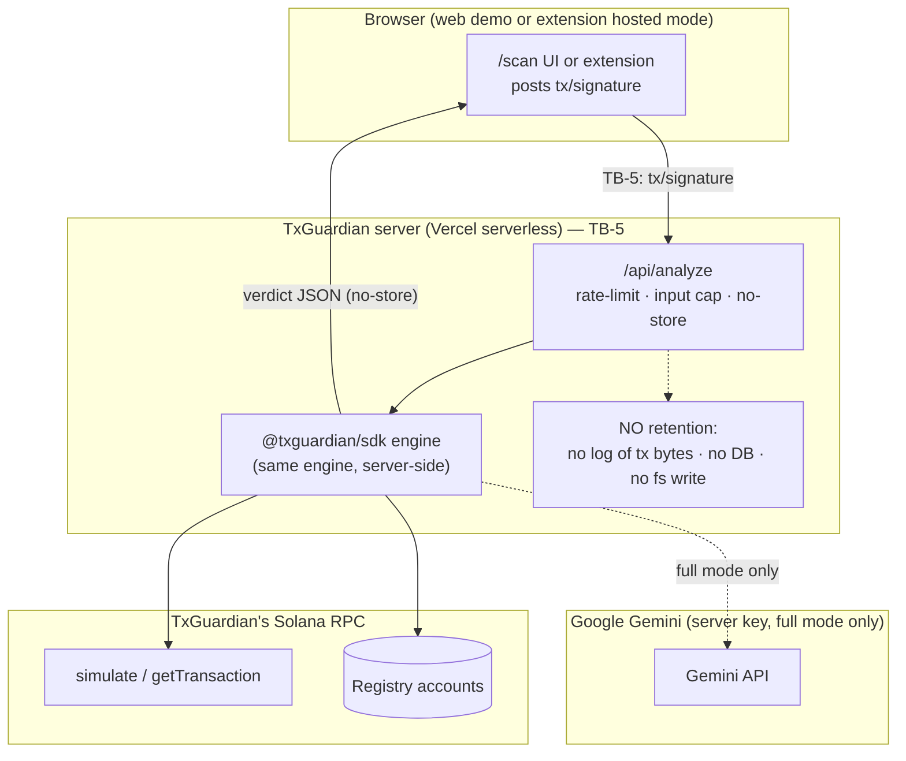
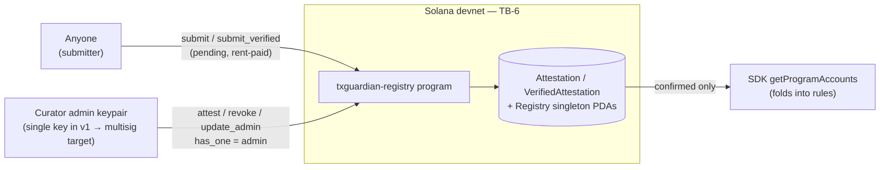

# TxGuardian — Data Flow Diagram (trust boundaries)

> Trust-boundary view of TxGuardian's data flows — the input to its STRIDE
> threat model (maintained as an internal document).
> A DFD names the *processes*, *data stores*, *external entities*, and the
> *flows* between them, and draws the **trust boundaries** those flows cross.
> Each numbered boundary (TB-n) is where STRIDE analysis is applied.

## Trust boundaries

| ID | Boundary | Crossed by |
|----|----------|------------|
| **TB-1** | Untrusted web origin ↔ extension | the intercepted signing request from any dApp |
| **TB-2** | Device ↔ user's Solana RPC | simulation + registry reads |
| **TB-3** | Deterministic engine ↔ attacker-submittable on-chain bytes | confirmed attestations folded into the rules |
| **TB-4** | Device ↔ Google Gemini | decoded summaries (BYO-key path), prose only |
| **TB-5** | Client ↔ TxGuardian server | **only** in the opt-in hosted fallback / `/scan` demo |
| **TB-6** | Tx signer ↔ Solana runtime | `submit` / admin `attest`/`revoke`/`update_admin` |

## Default path — extension (engine runs on-device)

In the default path the **TxGuardian server is never contacted** (no TB-5
crossing). The transaction is disclosed only to the user's own RPC, and decoded
summaries reach Google only if the user enabled the translator with their own
key.

## Opt-in path — hosted fallback / `/scan` web demo (engine runs server-side)

The opt-in path crosses **TB-5**: the full transaction reaches TxGuardian's
server. Confirmed behavior is a **stateless pass-through** — the tx is analyzed
in the function's memory and discarded; nothing is persisted server-side. In
`full` mode, decoded summaries also reach Google via TxGuardian's key.

## On-chain registry (TB-6)

Pending submissions never reach the engine — only `status === confirmed`
accounts are read, and confirmation requires the admin signature. The admin key
is the single irreducible trust point (custody + rotation are covered in the
internal threat model).
